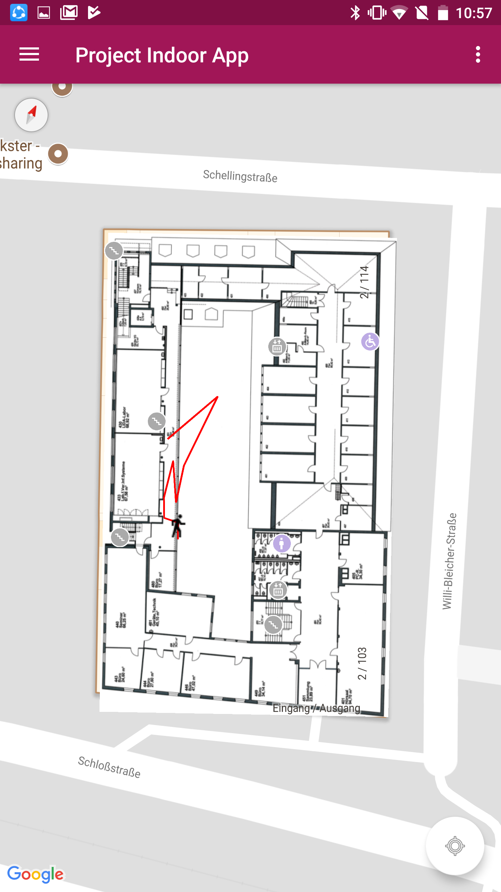
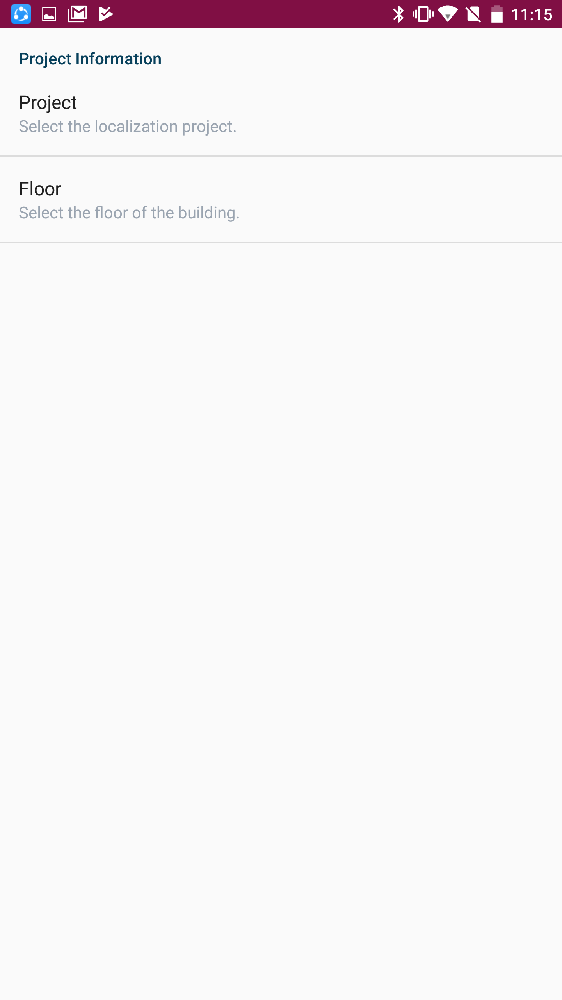
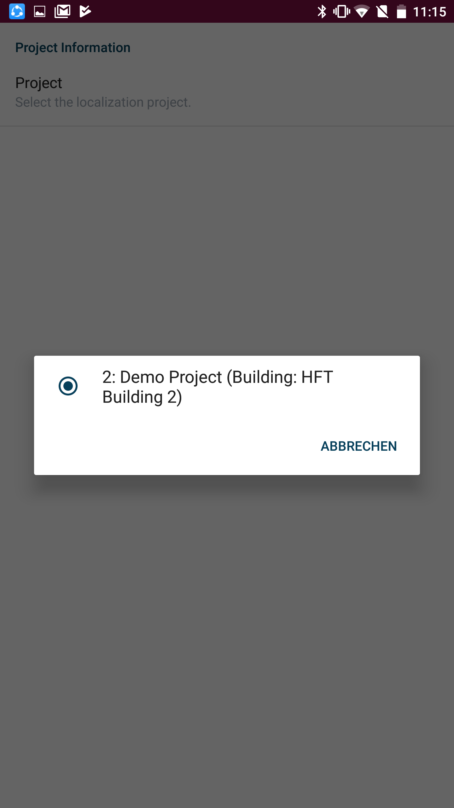
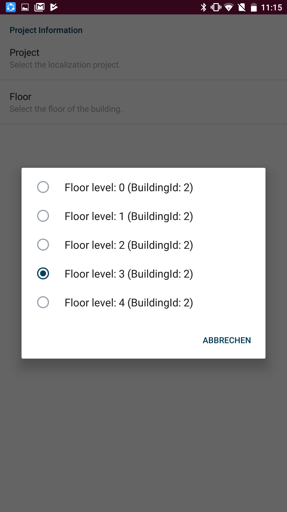
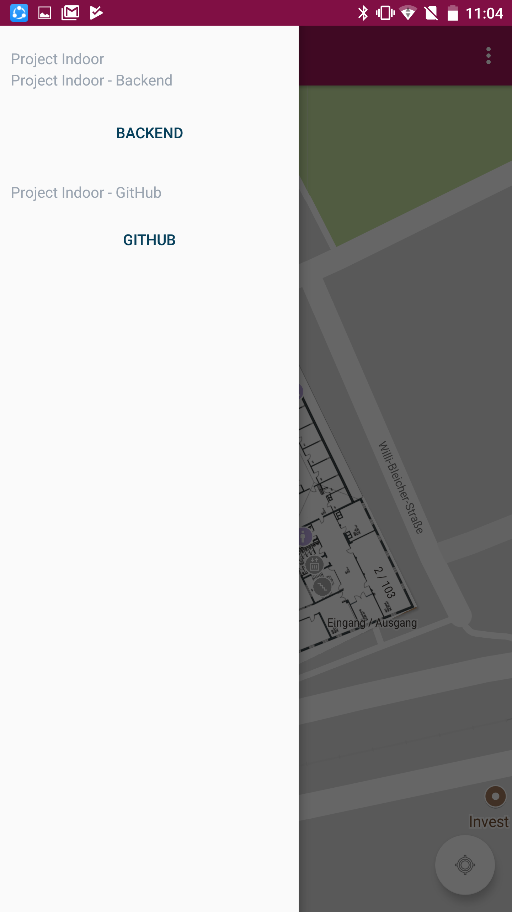

# Application Documentation

## Libraries
## File Structure
## App Overview

In this section, different components of the app will be discussed.

### Map view

The map view displays a Google map with a floor map of the selected HFT building floor map displaying.

#### Navigation

The navigation bar enables the user to navigate to the settings page (right cog icon) as well as opening the side menu (hamburger menu icon on the left).

### Settings page

In the settings page the user is able to select the project context and the floor he/she is on. Both the project list and the floor list are fetched dynamically using the backend's REST API.

### Side Menu

